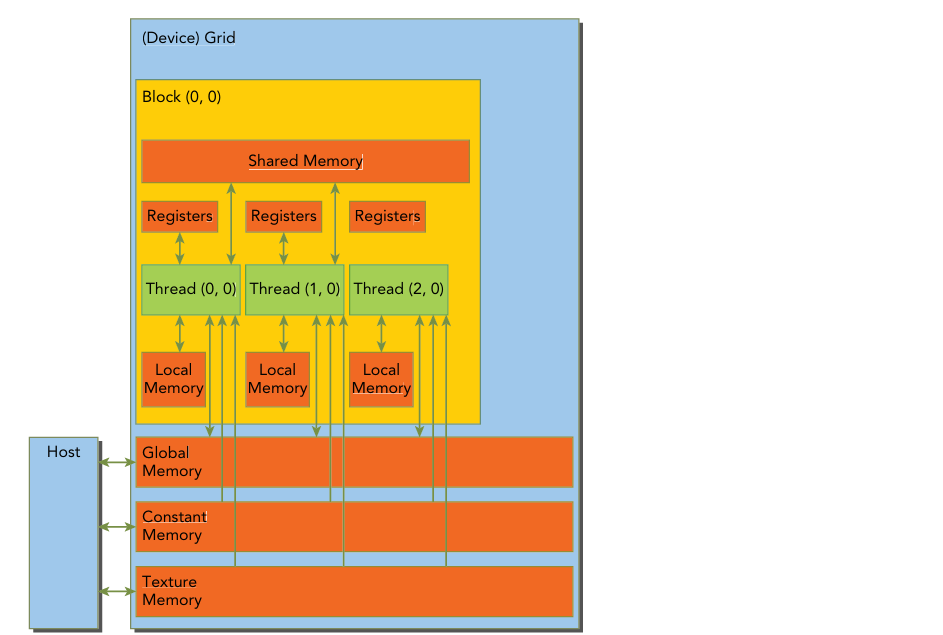
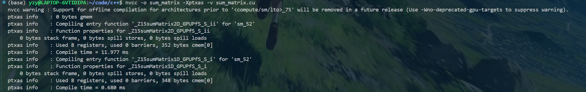

# CUDA内存模型学习

## 内存模型概述

### GPU内存设备

Registers
Shared memory
Local memory
Constant memory（常量内存）
Texture memory（纹理内存）
Global memory



**寄存器：**GPU上，核函数声明的变量，有常数长度的数组直接在寄存器上，寄存器溢出的内容，会被存储在本地内存，但是对效率影响很大，尽量保证不溢出

防止溢出：

```
__global__ void
__launch_bounds__(maxThreadaPerBlock,minBlocksPerMultiprocessor)
kernel(...) {
    /* kernel code */
}
```

maxThreadaPerBlock：线程块内包含的最大线程数，线程块由核函数来启动

minBlocksPerMultiprocessor：可选参数，每个SM中预期的最小的常驻内存块参数。对于一定的核函数，优化的启动边界会因为不同的结构而不同，也可以在编译选项中加入max rreg count  =32



在编译命令中插入上述编译选项，输出编译时内核所用到的寄存器、屏障（显示同步命令）和常量内存等

**本地内存：**高延迟，低带宽，存储以下数据：

未知索引引用的数组；

占用寄存器空间较大的数组或结构体；

不符合核函数寄存器存储条件的变量

**共享内存：**低延迟，高带宽，但是需要注意线程块共享内存占用大小的控制，以防每个线程块占用的空间过大，从而减少常驻活跃线程束的数量，降低效率

***根据架构的不同需要静态、动态（设置最大空间）甚至自动划分根据内核的实际执行过程***


**常量内存：**在核函数外定义；当线程束内的线程需要读取某些不变且计算过程中需要用到的相同的值，利用常量内存向线程束内所有线程广播的特性，一次请求并访存将数据拉取至常量内存中

**纹理内存：**只读内存空间，最初用于图形渲染中的纹理贴图采样，并不是一块物理上独立的内存，而是建立在全局内存（Global Memory）之上的一层缓存和特殊访问机制，为空间局部性内存访问模式的图形应用而设计

**全局内存：**即设备内存（硬件角度），全局内存访问是对齐，也就是一次要读取指定大小（32，64，128）整数倍字节的内存，实际中内存对齐的存储方式，可能会导致无用信息的读取，降低效率

### 静态内存分配

静态内存分配：

```
__device__ float Devdata
float value=3.14f
cudaMemcpyToSymbol(Devdata,&value,sizeof(float));//主机端devdata只是一个标识符，具体的设备地址需要该API根据符号表找到devdata对应的设备地址 主机本身不能识别该标识符
cudaMemcpyFromSymbol(&value,Devdata,sizeof(float));//可以理解为 从标识符到主机值，从主机到标识符地址
```

动态内存分配：

```
float *d_ptr =Null;
float value =3.14f;
cudaGetSymbolAddress((void**)&d_ptr,Devdata);
cudaMemcpy(d_ptr,&value,sizeof(flost),cudaMemcpyHostToDevice);
```

## 内存管理

### 内存的申请、初始化与释放：

```
float *devPtr=NULL;
cudaMalloc((void**)&devPtr,size_t count); //申请  &devPtr= float**  取地址 其实就是指针 
cudaMemset(void *devPtr,int value,size_t count);//初始化
//int value 是将目标区域的每个字节  填充为value的值   size_t count 也是字节数
cudaFree(*devPtr);//释放
```

size_t 可移植性更强 比int   unsigned int.

### 数据的显示传输：

```
cudaMemcpy(void *dst,const void * src,size_t count,enum cudaMemcpyKind kind)
```

Pcle和GPU内存带宽差距大，尽量减少设备和主机内存传输

### 固定内存：

申请： `cudaMallochost((void**)devptr,size_t count);`

释放：cudaHostFree(void*devptr);

固定内存可以直接传输到设备虽然分配和释放成本高 但是传输速率远远优于分页内存

### 零拷贝内存：

首先是固定内存，该内存在主机端，设备可以通过这块内存在主机端的指针 `**pDevice`访问数据，数据通过Pcle总线在主机和设备端传输。

```
cudaHostAlloc(void ** pHost,size_t count,unsigned int flags)
```

| 参数                       | 功能                                 |
| -------------------------- | ------------------------------------ |
| cudaHostAllocDefalt        | cudaMallocHost                       |
| cudaHostAllocPortable      | 返回能被所有CUDA上下文使用的固定内存 |
| cudaHostAllocWriteCombined | 写结合内存                           |
| cudaHostAllocMapped        | 零拷贝                               |

```
cudaError_t cudaHostGetDevicePointer(void ** pDevice,void * pHost,unsigned flags) //flag=0
```
