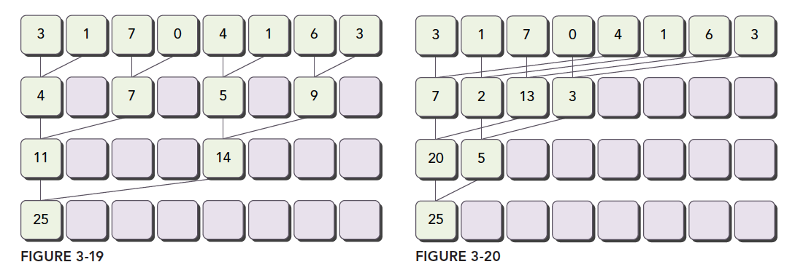
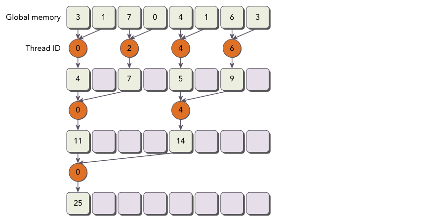
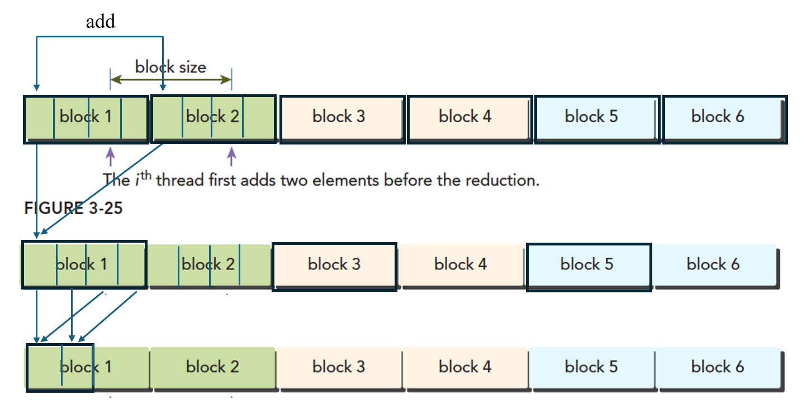
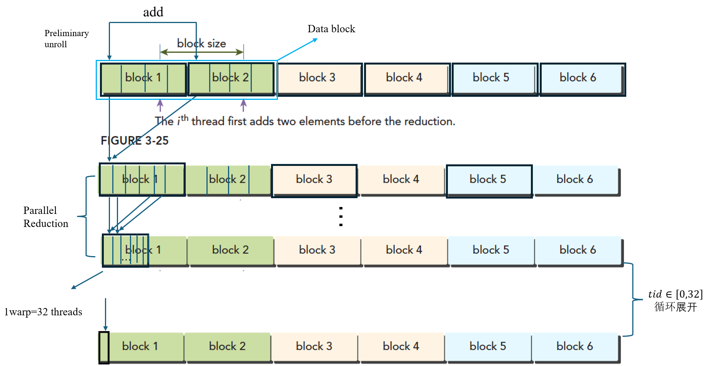

# CUDA执行模型

GPU架构（Fermi架构）SM


一个block只能被分配在一个SM上，但是一个SM上可以分配多个block

SIMD SIMT

CUDA采用SIMT架构管理执行线程，每个线程都有自己状态寄存器、指令地址计数器以及执行路径，使得编程模型支持每个线程的唯一编号，确保了每个线程之间的独立性

线程块内同步（需要显示调用__syncthreads())  块间不同步

divergence(分支发散)

```
__global__ void divergence(int* data){
int tid = threadIdx.x;
if(tid%2==0){
	data[tid]=1;
}else{
	data[tid]=2;
}
	__syncthreads();
}
```

SM上线程束之间的状态转换不需要开销（GPU的调度单位是wrap  一般wrap有32个线程  对应硬件的32 core)：

对比CPU状态转换  寄存器等提前分配好，不需要保存当前寄存器状态等。

wrap能够通过wrap快速切换 隐藏延迟

Giga thread  千兆线程

当一个线程块被指定给一个SM时，线程块内的所有线程被分成多个线程束，两个线程束在warp schedule的调度下在instruction Cache存储相应的指令后在SM上执行，多个线程束在这两个线程调度器的调度下 在SM上交替执行。

serial  concurrent

性能优化从程序的空间/时间复杂度、特殊指令的使用、函数调用的频率 和持续时间出发

## 线程束的硬件与逻辑形式

### 组织形式以及线程分支

三维坐标对应的线性转换：我们将三维空间视为分层结构（z 层），每层包含行（y 行），每行包含元素（x 位置）

x增长到最大 则y+1  即增加一行  直到 y增长到最大 即x.y确定的这一层 已满  则z+1
先小块  然后满行  满层  逐步填充。

则计算公式idx= threadidx.x+threadIdx*blockDim.x+threadidx.z *blockDim.x *blockDim.y

stall  execution (执行停滞)

如果将控制流的分化放在同一个线程束中，则会导致同一个线程束内有过多不符合当前判断条件的线程停滞，影响效率，为了防止线程分化带来的效率的严重下降，则可以通过分类方式将不同执行条件的线程 分别放在两个线程束中，修改上述分支发散的代码：

```
if(tid/wrapSize==0){
	data[tid]=1;
}else
	data[tid]=2;
```

当线程为64时，if else中的线程将能够在32线程上 分别执行

`((tid/warpSize)%2==0)//扩展至n个线程的场景`

### 资源分配

SM上线程束分为激活 未激活

激活：选定、符合条件、阻塞

未激活：只被分配 未上SM

寄存器 共享内存：线程越多 线程平均的资源越少

### 延迟隐藏

硬件利用率最大化 每时每刻  warp schedule都有可用的线程束可供调度

little法则
最小化延迟所需线程数=延迟*吞吐量

吞吐量 ：指实际操作过程中每分钟处理多少个指令

## 并行性表现

三元条件运算符： 条件？表达式1：表达式2  条件为真 返回式1 条件为假 返回式2

int dimx = argc>2? atoi(argv[1]):32

根据命令行输入 初始化 dimx argc是命令行参数个数 argv存储命令行参数 argc一般为运行的文件名

```
./example  32 32
```

a to i  -> str to l      argc =   `strtol(str, NULL, 10)  如果要转换为int型：需注意`

```
#include<limits.h>
if(argc<INT_MIN||ARGC>INT_MAX)//输出检查
```

不同大小块的代码执行效率与机器本身有关

### 占有率计算与区分

1.cuda下的tools中自带的xlsx CUDA GPU occupancy calculator 是理论计算的占有率

```
2.ncu --metrics sm__warps_active.avg.pct_of_peak_sustained_active ./simple_sum_matrix
```

该命令是实际的占有率 actived_occupancy活跃线程束比例，但是该比率高 不一定执行速度就快。


### 内存利用率

吞吐量：nvprof --metrics gld_throughput ./simple_sum_matrix

    l1tex__t_bytes_pipe_lsu_mem_global_op_ld.sum.per_second

全局加载效率：nvprof --metrics gld_efficiency ./simple_sum_matrix
	smsp__sass_average_data_bytes_per_sector_mem_global_op_ld.pct

常用指标对照

| achieved_occupancy | sm__warps_active.avg.pct_of_peak_sustained_active                    |
| ------------------ | -------------------------------------------------------------------- |
| gld_throughput     | l1tex__t_sectors_pipe_lsu_mem_global_op_ld.sum 并不完全一致          |
| gst_throughput     | l1tex__t_bytes_pipe_lsu_mem_global_op_st.sum.per_second              |
| gld_efficiency     | smsp__sass_average_data_bytes_per_sector_mem_global_op_ld.pct        |
| shared_efficiency  | smsp__sass_average_data_bytes_per_wavefront_mem_shared.pct           |
| branch_efficiency  | smsp__sass_thread_inst_executed_op_control_pred_on.sum               |
| inst_per_warp      | ncu --metrics  smsp__average_inst_executed_per_warp ./reduceInteger |

多因一效

## 避免分支化

一般是将数据分块 ，每个线程处理一小部分数据 ，所以一个线程块能够处理一大部分数据，多个线程块完成处理整个数据集，最后将数据从设备copy到主机，由CPU对这些线程的数据进行运算

### 并行归约问题

相邻配对																交错配对



#### 相邻配对线程分析



上图每一层的线程都是并行的，但是同一层中的线程计算也是有快有慢 为了保证 下一层的输入能够准确传入，需要强制同步，避免块内线程竞争内存

被操作的两个对象之间的距离叫做跨度，一般记为stride

```
$\frac(tion){1}{2}$//  1/2
```

初始代码优化过程的理解：

```
for (int stride = 1; stride < blockDim.x; stride *= 2)
	{
		if ((tid % (2 * stride)) == 0)
		{
			idata[tid] += idata[tid + stride];
		}
		//synchronize within block
		__syncthreads();
	}
```

上述代码中， 直接选择偶数线程进行数据的处理，导致其中的奇数线程闲置等待，资源浪费。可以发现该方式直接利用线程编号tid作为数组的索引，导致线程分化。为此提出了第二种方式，index = 2 * stride *tid  。

```
for (int stride = 1; stride < blockDim.x; stride *= 2)
	{
		//convert tid into local array index
		int index = 2 * stride *tid;
		if (index < blockDim.x)
		{
			idata[index] += idata[index + stride];
		}
		__syncthreads();
	}
```

该方法通过第一种方法转换而来，(tid % (2 * stride)==0——> tid=2*stride *k,此处的k 随着tid 的变化  连续增长0.1.2.3...   将k换做  tid , tid替换成 index  即index = 2 * stride *tid，则idata[tid]==idata[index],  由此，将直接用tid编号的数组换为了 tid 映射的index编号，保证了线程数据计算方式不变，但是线程分配由偶数线程到 连续线程的转换，优化了线程的分支发散。

#### 交错配对

通过对stride的修改，`（stride=blockDim.x/2)`,也能够将线程的启用 `(idata[tid]=idata[tid]+idata[tid+stride])`集中在线程束的前一部分。

## 循环展开

一个尝试通过减少分支出现的频率和循环维护指令来优化循环的技术

```
for(i=0;i<=100;i++){
	a[i]=b[i]+c[i];
}
```

手动展开循环：

```
for(i=0;i<=100;i+=4){
	a[i]=b[i]+c[i];
	a[i+1]=b[i+1]+c[i+1];
	a[i+2]=b[i+2]+c[i+2];
	a[i+3]=b[i+3]+c[i+3];
}
```

### 归约初步展开

```
g_idata[idx]+=g_idata[idx+blockDim.x*2*stride]
```

将相邻的单位数据块逻辑上合并为一个大的数据块，通过提前对两个相邻的数据块相加处理，得到一个单位大小不变，数值变化的单位大小数据块，对整个数据块做同样的操作，得到多个处理后的合并数据块。此时这些合并后的数据块，只有前半部分的线程是有用数据，只处理前半部分数据，即这个单位大小的数据块，初始跨度为 `blockDim.x/2`, 之后 `stride>>1`，进行交错配对归并。第一步合并，减少了一半的数据块循环，以及块内的归并计算。



### 完全展开的归约

下述代码区别于上述初步的展开，在数据归约前，对数据划分进行相加的预处理，在归约过程中也加入了循环展开的优化。

```
__global__ void reduceUnrollWarp8(int * g_idata,int * g_odata,unsigned int n)
{
	//set thread ID
	unsigned int tid = threadIdx.x;
	unsigned int idx = blockDim.x*blockIdx.x*8+threadIdx.x;
	//boundary check
	if (tid >= n) return;
	//convert global data pointer to the
	int *idata = g_idata + blockIdx.x*blockDim.x*8;
	//unrolling 8;
	if(idx+7 * blockDim.x<n)
	{
		int a1=g_idata[idx];
		int a2=g_idata[idx+blockDim.x];
		int a3=g_idata[idx+2*blockDim.x];
		int a4=g_idata[idx+3*blockDim.x];
		int a5=g_idata[idx+4*blockDim.x];
		int a6=g_idata[idx+5*blockDim.x];
		int a7=g_idata[idx+6*blockDim.x];
		int a8=g_idata[idx+7*blockDim.x];
		g_idata[idx]=a1+a2+a3+a4+a5+a6+a7+a8;

	}
	__syncthreads();
	//in-place reduction in global memory
	for (int stride = blockDim.x/2; stride>32; stride >>=1)
	{
		if (tid <stride)
		{
			idata[tid] += idata[tid + stride];
		}
		//synchronize within block
		__syncthreads();
	}
	//write result for this block to global mem
	if(tid<32)
	{
		volatile int *vmem = idata;
		vmem[tid]+=vmem[tid+32];
		vmem[tid]+=vmem[tid+16];
		vmem[tid]+=vmem[tid+8];
		vmem[tid]+=vmem[tid+4];
		vmem[tid]+=vmem[tid+2];
		vmem[tid]+=vmem[tid+1];

	}

	if (tid == 0)
		g_odata[blockIdx.x] = idata[0];

}
```

对上述所有代码的逻辑  ，主要分为三步，  首先通过对一个数据块内的特定位置的数相加  以此实现用一个线程块去处理，然后在这个线程块内 进行初步归约至最后32个线程块，然后再对32线程块的归约进行循环展开优化，得到最后的结果，多个数据块分别在对应的多个线程块上进行计算。



warp同步执行

```
	if(tid<32)
	{
		volatile int *vmem = idata;
		vmem[tid]+=vmem[tid+32];
		vmem[tid]+=vmem[tid+16];
		vmem[tid]+=vmem[tid+8];
		vmem[tid]+=vmem[tid+4];
		vmem[tid]+=vmem[tid+2];
		vmem[tid]+=vmem[tid+1];

	}
```

上述代码疑问：每个线程都在并行执行这段代码 那么会不会产生 其他线程读取更改后的数值，被某个线程读取继续计算，因为线程都是并行执行的 可能vmem[16]+=vmem[16+32]   然后在线程0执行这段代码时候，vmem[0]+=vmem[0+16]时，vmem[16]已经被更改？

**第一步：所有线程同时执行 vmem[tid] += vmem[tid+32] ；第二步：所有线程同时执行 vmem[tid] += vmem[tid+16]**

同一个warp内，所有线程同时执行相同的指令，每个指令都作为一个隐式的同步屏障。在所有线程完成当前指令之前，没有线程会开始执行下一条指令

由于使用了 `volatile`关键字，强制vmem的读写必须在内存中进行，禁止了编译器的优化行为，所有内存写入都会立即变得对其他线程可见，而不是利用内存读取到寄存器中可能过期的缓存值

warp内的线程不是真正"并行"执行多条不同指令，而是同步执行同一条指令（只是操作不同的数据）

```
(base) yzy@LAPTOP-6VTIDIPA:~/code/c++$ ./reduceUnrolling
Using device 0: NVIDIA GeForce RTX 5070 Laptop GPU
        with array size 16777216  grid 16384 block 1024 
cpu sum:2139006520 
cpu reduce                  elapsed 0.027207 ms cpu_sum: 2139006520
gpu warmup                  elapsed 0.254142 ms 
reduceUnrolling2            elapsed 0.000509 ms gpu_sum: 2139006520<<<grid 8192 block 1024>>>
reduceUnrolling4            elapsed 0.000450 ms gpu_sum: 2139006520<<<grid 4096 block 1024>>>
reduceUnrolling8            elapsed 0.000647 ms gpu_sum: 2139006520<<<grid 2048 block 1024>>>
reduceUnrollingWarp8        elapsed 0.000343 ms gpu_sum: 2139006520<<<grid 2048 block 1024>>>
reduceCompleteUnrollWarp8   elapsed 0.000346 ms gpu_sum: 2139006520<<<grid 2048 block 1024>>>
reduceCompleteUnroll        elapsed 0.000371 ms gpu_sum: 2139006520<<<grid 2048 block 1024>>>

(base) yzy@LAPTOP-6VTIDIPA:~/code/c++$ ./reduceUnrolling
Using device 0: NVIDIA GeForce RTX 5070 Laptop GPU
        with array size 16777216  grid 16384 block 1024 
cpu sum:2139148312 
cpu reduce                  elapsed 0.026057 ms cpu_sum: 2139148312
gpu warmup                  elapsed 0.008614 ms 
reduceUnrolling2            elapsed 0.000396 ms gpu_sum: 2139148312<<<grid 8192 block 1024>>>
reduceUnrolling4            elapsed 0.000384 ms gpu_sum: 2139148312<<<grid 4096 block 1024>>>
reduceUnrolling8            elapsed 0.000366 ms gpu_sum: 2139148312<<<grid 2048 block 1024>>>
reduceUnrollingWarp8        elapsed 0.000350 ms gpu_sum: 2139148312<<<grid 2048 block 1024>>>
reduceCompleteUnrollWarp8   elapsed 0.000336 ms gpu_sum: 2139148312<<<grid 2048 block 1024>>>
reduceCompleteUnroll        elapsed 0.000343 ms gpu_sum: 2139148312<<<grid 2048 block 1024>>>

(base) yzy@LAPTOP-6VTIDIPA:~/code/c++$ ./reduceUnrolling
Using device 0: NVIDIA GeForce RTX 5070 Laptop GPU
        with array size 16777216  grid 16384 block 1024 
cpu sum:2139333888 
cpu reduce                  elapsed 0.025430 ms cpu_sum: 2139333888
gpu warmup                  elapsed 0.001927 ms 
reduceUnrolling2            elapsed 0.000500 ms gpu_sum: 2139333888<<<grid 8192 block 1024>>>
reduceUnrolling4            elapsed 0.000640 ms gpu_sum: 2139333888<<<grid 4096 block 1024>>>
reduceUnrolling8            elapsed 0.000440 ms gpu_sum: 2139333888<<<grid 2048 block 1024>>>
reduceUnrollingWarp8        elapsed 0.000361 ms gpu_sum: 2139333888<<<grid 2048 block 1024>>>
reduceCompleteUnrollWarp8   elapsed 0.000367 ms gpu_sum: 2139333888<<<grid 2048 block 1024>>>
reduceCompleteUnroll        elapsed 0.000312 ms gpu_sum: 2139333888<<<grid 2048 block 1024>>>

```

数据对比还是有出入的

### Reducing with Template Functions

`if(blockDim.x>=1024 && tid <512)`

该设计使得同一段代码能够适配不同blockDim.x大小的线程块，无需编译不同版本
