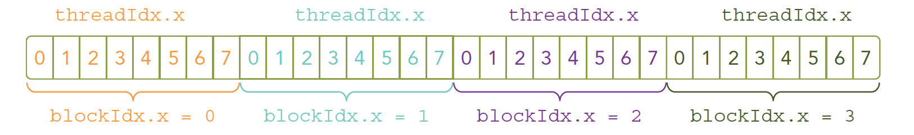
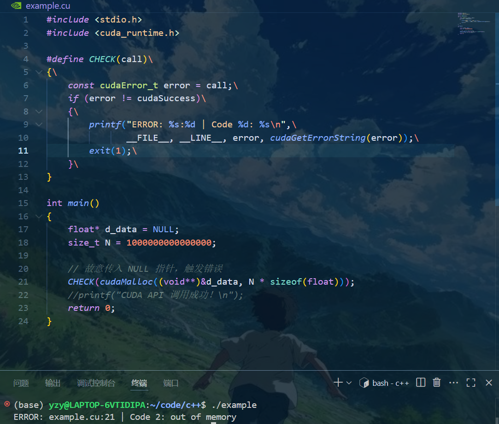
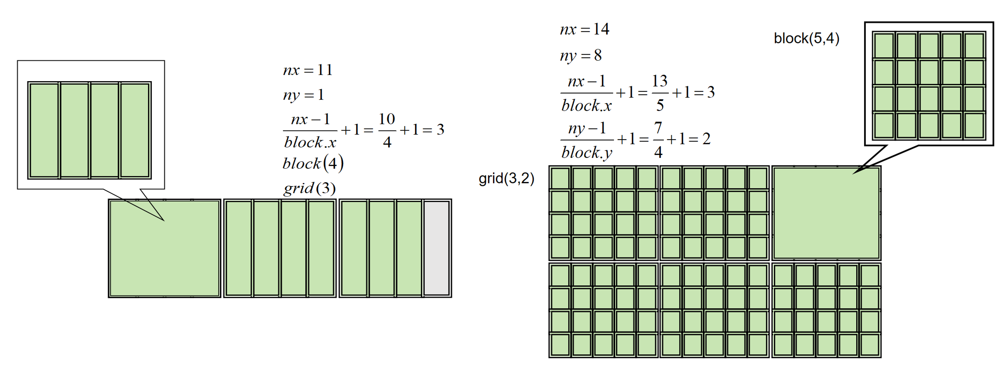
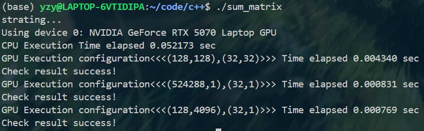
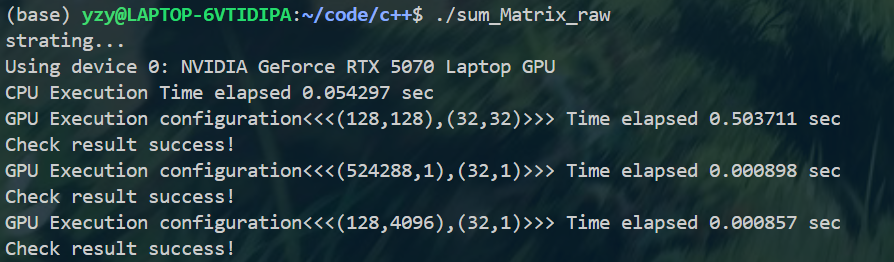
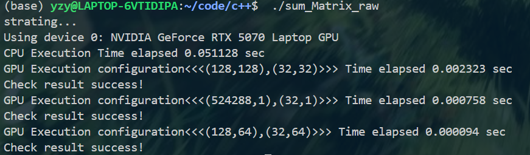

# CUDA编程模型学习

## 核函数

核函数被调用后 控制权立即还给主机线程 即  GPU并行程序执行的同时  下一段host代码可能已经被CPU执行   程序异步执行

一个核函数对应一个grid
一个grid 以二维划分为线程block  blockldx.x blockldx.y
一个block以三维划分线程    threadldx.x  threadldx.y threadldx.z
主机端 dim   可修改  设备端unti  初始化完成 不可修改

```
//一维网格
int nElem= 6
dim3 block(3)
dim3 grid((nElem-1)/block.x+1)
```

**cuda  device Synchronize 让(CPU)与GPU  同步  阻塞CPU当前线程，当GPU任务处理完，CPU继续执行后续代码**

默认情况：在核函数调用后，如果需要 GPU 的计算结果，加上 cudaDeviceSynchronize()。

高性能场景：使用 CUDA 流（Stream） 和 异步内存拷贝（cudaMemcpyAsync） 来减少同步开销。



硬件中实际以线性存储 所以需要用blockidx 和threadldx 组合进行唯一标识且定位  从而实现同样的程序  处理不同的数据

### 编写

Kernel核函数编写有以下限制:

只能访问设备内存;必须有void返回类型;不支持可变数量的参数;不支持静态变量;显示异步行为.

串行代码块for并行化处理

### 验证

对核函数验证所带来的影响 远远小于报错的影响损失

使用如下的宏定义 实现检错 （但是该宏在遇到第一个错误后即结束运行，一次检查一处错误）

```
#define CHECK(call)\
{\
  const cudaError_t error = call;\
  if (error != cudaSuccess)\
  {\
    printf("ERROR: %s:%d,", __FILE__, __LINE__);\
    printf("code:%d,reason:%s\n", error, cudaGetErrorString(error));\
    exit(1);\
  }\
}
```

c/c++宏定义只能写一行  "/"换行

call为cuda API调用 -> CHECK(cudafunction(param)); 如 `CHECK(cudaMalloc(&d_data, N * sizeof(float)));`

cuda API的每一个调用都会返回cudaError_t 枚举类型中的一个  ,当调用成功时 返回 cudaSuccess  （value= 0）

当宏定义被执行时，扩展为代码块，减少函数调用开销；宏定义 使用__file__ 以及__line__定位到当前代码实际调用CUDA API的位置如下图所示，若用函数定义，则会指向函数内部的代码位置



```
#include <stdio.h>
#include <cuda_runtime.h>

#define CHECK(call)\
{\
    const cudaError_t error = call;\
    if (error != cudaSuccess)\
    {\
        printf("ERROR: %s:%d | Code %d: %s\n",\
               __FILE__, __LINE__, error, cudaGetErrorString(error));\
        exit(1);\
    }\
}

int main()
{
    float* d_data = NULL;//d_date指向float的指针  存储某个float数据的地址   
    size_t N = 1000000000000000;

    // 故意传入 NULL 指针，触发错误
    CHECK(cudaMalloc((void**)&d_data, N * sizeof(float)));// void**指针的指针 float*本身还有自己的地址  需要用float**指向  (void**)数据类型的强制转换
    //printf("CUDA API 调用成功！\n");
    return 0;
}
(base) yzy@LAPTOP-6VTIDIPA:~/code/c++$ ./example
ERROR: example.cu:21 | Code 2: out of memory
```

```
#include<cuda_runtime.h>
cudaGetErrorString（）
```

*特殊情况：API调用返回 ，但是核函数异步 默认不返回错误码 处理方式：

```
my_kernel<<<blocks, threads>>>(...);
CHECK(cudaGetLastError());  // 检查核函数是否启动成功
CHECK(cudaDeviceSynchronize());  // 检查核函数执行是否出错
```

### 计时

clock_t 数据类型 unsigned long ,typedef long clock_t ?  与clock()记录的CPU时钟周期数

```
#include<time.h>
clock_t start,finish
(finish-start)/CLOCKS_PER_SEC //转换成秒
```

但是上述计数方式并不适用于并行计算的程序 因为年代因素的限制 导致clock()仅仅计算CPU上的运行时间 且只考虑单线程，如果调用可能导致返回当前所有线程时间的总和。

并行计算用墙钟时间clock_gettime()   gettimeofday() 或者专用API  CUDA Event

```
//gettimeofday()
#include<sys/time.h>
struct timeval start,end;
gettimeofday(&start,NULL);
//并行计算
gettimeofday(&end,NULL);
double duration = [(end.tv_sec-start.tv_sec)+(end.tv_usec-start.tv_usec)/1e6];//   /1e6-> *1e-6   10^-6   s  ms μs  ns  3.6.9
```

更精准 纳秒级(nsec)  更稳定不受系统时间跳变影响

```
//clock_gettime
#include <time.h>
struct timespec start, end;
clock_gettime(CLOCK_MONOTONIC, &start); // 开始计时

// 并行计算

clock_gettime(CLOCK_MONOTONIC, &end);
double duration = (end.tv_sec - start.tv_sec) + (end.tv_nsec - start.tv_nsec) / 1e9;
printf("Wall time: %f sec\n", duration);
```

```
struct timeval {
    time_t      tv_sec;   // 秒（自 1970-01-01 00:00:00 UTC 起的秒数）
    suseconds_t tv_usec;  // 微秒（0 ~ 999,999）μsec->usec
};
```

指针书写注意：

```
int *p;  // 强调 *p 是一个int（即p指向int）
int* p;  // 强调 p是int*类型
```

1.主机调用核函数——>2.核函数启动——>3.控制返回主机线程——>4.核函数执行完毕——>5.主机同步，核函数执行结果返回主机
CPU计时1-5  长于2-4  核函数在GPU实际执行的时间

CPU计时时需要加入同步函数cudaDeviceSynchronize(),以确保CPU和GPU异步执行出现如下情况：

```
CPU: [启动核函数] -> [记录结束时间] -> [其他代码]
GPU:           |__[执行核函数]__|
```

因为CPU和GPU**异步并行**，控制权本身没有转移，CPU控制代码的读取，GPU则可能与此同时在进行核函数的执行，各司其职。同步函数只是负责CPU主动等待GPU的执行完成，再进行下一条指令的读取。（区别于控制权核心态和用户态的转移）

当数据不能被分为完整的数据块时，计算时间会明显增加，可考虑将完整切块后剩余数据进行 CPU计算。

nvprof——>**Nsigaht compute**(ncu)[系统级性能分析，可视化 CPU/GPU 活动、内存传输、API 调用等]

和**Nsight systems**(nsys)[系统级性能分析，可视化 CPU/GPU 活动、内存传输、API 调用等]

## 并行线程组织模式

以线程为基本单位，为每个线程编号。(ix,iy)全局地址

ix=threadidx.x+blockidx.x*blockDim.x

iy=threadidx.y+blockidx.y*blockDim.y

利用行优先存储的特性  iy前  有iy行 先存储这iy行，即 iy*nx  在idx=iy行  偏移量为ix  则idx=ix+iy*nx

#### 2d grid 2d block

```
dim3 block(nx,ny);
dim3 grid((nx-i)/block.x+1,(ny-i)/block.y+1);
_kernal_<<<grid,block>>>();
```



通过组织不同大小的网格和线程块的组合使得核函数的计算效率不同  矩阵运算GPU计算速度远大于CPU计算。



问题：第一次编译后执行文件  GPU 二维block的计算时间特别长  且在之后的计算结果中 二维block的计算时间都要长于 一维。进一步实验发现，可能是初次启动设备初始化造成的，因为第二次二维block计算速度非常快。





## GPU设备信息检查

CUDA应用对象：通用框架/自用

通用程序的编写：

用脚本获取设备信息，然后在编译时将参数固化进二进制机器码的可执行文件 直接运行程序 消除程序运行时擦查询设备参数带来的资源开销。

`nvidia-smi -q -i 0     //指定设备编号`
